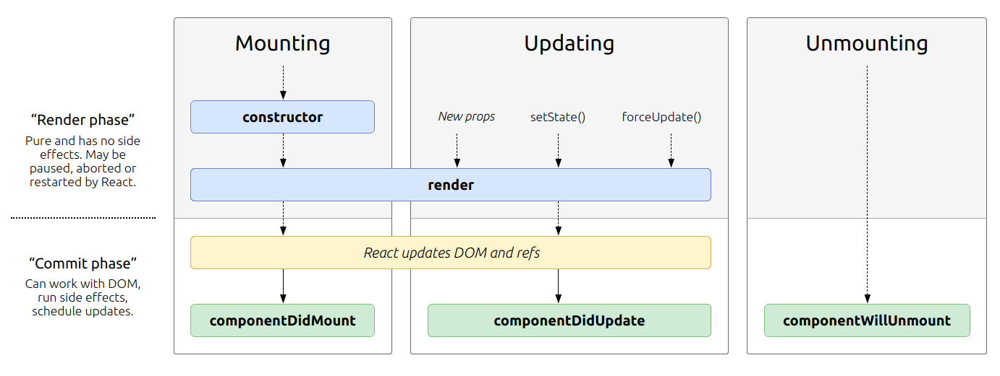

# Topics Covered

- Refactored Code to make it more readable by dividing different functionalities into it's own seperate component.
  - Components that handle state should be put in the container folder and any component that does not manage state should be in a seperate component folder.

use `git checkout 887f29` to see the code.

## Component Lifecycle Hooks ( Important )

Mounting -> component is constructed
Updating -> when the state of the component is updated
Unmounting -> when the component is removed from the page

_all of them run in order(one after the other)_

- constructor(props)

  - Call super(props)
  - DO -> Basic initialisation like Setting up state
  - DON'T -> Side effects( http requests , storing something to local storage, google analytics etc. )

- render() -> used to prepare and structure the JSX we write

  - render child components

## Commonly used lifecycle hooks



## componentDidMount()

`componentDidMount()` is invoked immediately after a component is mounted (inserted into the tree). Initialization that requires DOM nodes should go here. If you need to load data from a remote endpoint, this is a good place to instantiate the network request.

This method is a good place to set up any subscriptions. If you do that, don’t forget to unsubscribe in `componentWillUnmount()`.

## componentDidUpdate(prevProps, prevState, snapshot)

`componentDidUpdate()` is invoked immediately after updating occurs. This method is not called for the initial render.

Use this as an opportunity to operate on the DOM when the component has been updated. This is also a good place to do network requests as long as you compare the current props to previous props (e.g. a network request may not be necessary if the props have not changed).

```javascript
componentDidUpdate(prevProps) {
  // Typical usage (don't forget to compare props):
  if (this.props.userID !== prevProps.userID) {
    this.fetchData(this.props.userID);
  }
}
```

## componentWillUnmount()

`componentWillUnmount()` is invoked immediately before a component is unmounted and destroyed. Perform any necessary cleanup in this method, such as invalidating timers, canceling network requests, or cleaning up any subscriptions that were created in `componentDidMount()`.

You should not call `setState()` in `componentWillUnmount()` because the component will never be re-rendered. Once a component instance is unmounted, it will never be mounted again.

## shouldComponentUpdate(nextProps, nextState)

**use only for performance optimisations**

Use `shouldComponentUpdate()` to let React know if a component’s output is not affected by the current change in state or props. The default behavior is to re-render on every state change, and in the vast majority of cases you should rely on the default behavior.

Default is true.

`shouldComponentUpdate()` is invoked before rendering when new props or state are being received. Defaults to true. This method only exists as a **performance optimization**. Do not rely on it to “prevent” a rendering, as this can lead to bugs.

**Use React.memo() for performance optimisations in functional components by wrapping the entire export statement in React.memo(component) which will basically store a snapshot of the component and only change it when the props gets changed**

Refer documentation for more hooks that are rarely used for niche cases/ legacy hooks ( not really useful )
<a href='https://reactjs.org/docs/react-component.html'>React Lifecycle Hooks documentation</a>

## Using refs for DOM access

1st way => Pass in the element into the ref prop as in a anonymous function which can then be accessed anywhere in the class instance using the this keyword.

2nd way => Create a ref in the constructor using `React.createRef` and then reference it in the ref prop.
